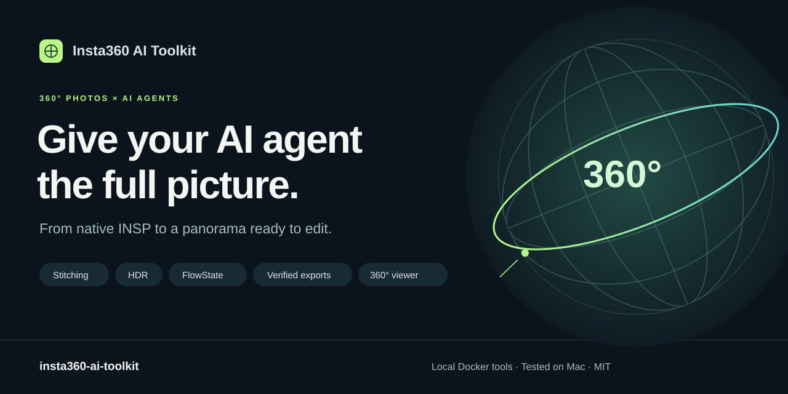

# Insta360 AI Toolkit

**Give your AI agent the full picture.** Stitch, level and prepare Insta360 360° photos for editing—with a reusable agent skill, local Docker tools, a Studio RAW export workflow and a 360° photo viewer.



[Get started](#get-started) · [Try a prompt](#one-prompt-a-complete-photo-workflow) · [360° viewer](#explore-your-panorama) · [What works](#what-we-verified) · [SDK reference](skills/insta360-sdk/references/media-sdk.md) · [MIT license](LICENSE)

**Saved-photo postprocessing** · **Studio or bring-your-own SDK** · **SDK-free panorama viewer**

> **For the full Studio feature set and best results, we recommend Insta360 Studio.** Where your AI agent supports computer use, have it operate the installed Studio application and inspect the exported images. Otherwise, use Studio manually. The [Studio DNG workflow](skills/insta360-sdk/references/runtime.md#studio-full-sphere-dng-export) provides a verified RAW-derived route into further photo editing.
>
> **The SDK route has limitations.** This toolkit automates selected SDK features; it does not provide Studio feature parity. In our tested SDK build, direct DNG stitching failed image acceptance, and successful GPU-assisted AI stitching combined NVIDIA compute with software OpenGL rendering. Full NVIDIA graphics remains unverified. See [what we verified](#what-we-verified) before choosing the SDK route.

## Your camera captures the sphere. Your agent handles the workflow.

An Insta360 original needs more than a normal image editor. It carries lens calibration, gyro data and sometimes an exposure bracket. This toolkit gives a coding agent the instructions and executable tools to inspect that input, stitch a panorama, correct its orientation, choose processing options and check the result before the photographic edit begins.

```text
Native INSP → inspect & group → stitch / HDR / FlowState → verify → 360° viewer → photo editor
```

- **Work in natural language.** Ask your agent for a level panorama, an HDR merge or a comparison of stitching settings.
- **Use the whole photo workflow.** Single-image stitching, exposure brackets, 11 colour/detail controls, ColorPlus, denoise and native metadata inspection.
- **Keep processing local.** Original files and SDK libraries are mounted read-only. Processing containers have networking disabled; outputs go to your project.
- **Check the actual result.** Detect blank images and wrong dimensions, preserve source hashes, then inspect horizons and seams. A successful SDK return value alone does not establish a good panorama.
- **Choose the final form.** Keep the edited panorama spherical with verified GPano dimensions, or export a reproducible yaw/pitch/FOV reframe as a normal photo using the [editing handoff](skills/insta360-sdk/references/photo-edit-handoff.md).
- **Explore the result.** Open the included 360° viewer to look around, zoom, auto-rotate and inspect seams in context. Viewing an existing panorama needs no SDK or Docker.
- **Reuse the setup.** One SDK directory can serve multiple projects, each with its own originals and results.

The included installer targets Codex. Other file- and terminal-capable agents can read [SKILL.md](skills/insta360-sdk/SKILL.md) directly or install the folder in their skill directory. The toolkit supplies an agent skill and CLI helpers; your chosen agent provides the language model. Its own data-handling settings still apply.

## Independent tools, one photo workflow

This toolkit works on its own. [Lightweft](https://github.com/sheldonxxxx/lightweft) is the central workspace for the wider AI photo-editing ecosystem: image-specific direction, personal style exploration and shared visual review. Add this toolkit when a photo needs Insta360 preparation, and add the independently maintained [RapidRAW fork](https://github.com/sheldonxxxx/RapidRAW) when you want a tested native editing engine with optional MCP control. Each project has its own installation, releases and requirements.

```text
Insta360 AI Toolkit: prepare a sphere or flat reframe
                       ↓
Lightweft: direct the edit → review candidates → refine your style
                       ↕
RapidRAW or another available editor: edit and export
```

Use the [editing handoff](skills/insta360-sdk/references/photo-edit-handoff.md) to carry source identity, processing settings and the chosen representation into the editor. Lightweft and RapidRAW are optional; installing this toolkit does not install either companion.

## One prompt, a complete photo workflow

After setup, try:

> Use $insta360-sdk to turn the native INSP in originals into a level 360° panorama. Start with a review-size optical-flow stitch and FlowState. Check the horizon, seams and image integrity, then export the chosen settings at the source's full panorama resolution. Keep the original unchanged and save the processing recipe beside the output.

Or ask for a focused task:

| You want to… | Ask your agent… |
|---|---|
| Merge an exposure bracket | “Confirm these INSP files belong to one bracket, then stitch an HDR panorama.” |
| Compare processing choices | “Compare template and optical-flow stitching with the same orientation and dimensions.” |
| Preserve a RAW-derived path | “Use Studio to export a full-sphere DNG, verify its RAW development, then keep it spherical or make a high-precision flat reframe.” |
| Prepare an editing handoff | “Export a stitched derivative for my photo editor with its source hashes and processing settings.” |

Photo-editor integration depends on the editor and tools available to your agent. Camera control is outside this project. Video/frame-export APIs are documented, but the CLI and runtime verification currently cover photos and metadata.

## Get started

Choose the route that fits your source and desired result:

| Start with | Use | Prerequisites |
|---|---|---|
| An already stitched panorama | [Local 360 viewer](#explore-your-panorama) | Python 3.10+ and a WebGL browser; no agent, SDK or Docker |
| Native 360 DNG and its paired INSP | [Studio full-sphere DNG export](skills/insta360-sdk/references/runtime.md#studio-full-sphere-dng-export) | Installed Insta360 Studio and a qualified RAW editor |
| Native INSP for repeatable agent/CLI processing | SDK setup below | Python 3.10+, Docker and separately approved SDK downloads |
| An ordinary flat photo | [Lightweft](https://github.com/sheldonxxxx/lightweft) or your editor | No Insta360 processing required |

Download the source or clone the independent repository:

```sh
git clone https://github.com/sheldonxxxx/insta360-ai-toolkit.git
cd insta360-ai-toolkit
```

The prompts work after installing the skill and satisfying the selected route's requirements. The viewer can be tried immediately with your own stitched panorama.

### SDK prerequisites

You need **Python 3.10+**, a running Docker engine capable of `linux/amd64`, and approved **Linux MediaSDK and InsMetaDataSDK** downloads. Pillow is used for image verification; NumPy is also required for the optional sphere reprojection and delivery-metadata helper; developed RGB16 TIFF reprojection additionally requires tifffile and imagecodecs. The separate [Studio DNG route](skills/insta360-sdk/references/runtime.md#studio-full-sphere-dng-export) uses the installed Studio application and does not require the SDK or Docker. The SDK was tested in **Ubuntu 22.04 amd64 containers on Apple Silicon and x86-64 Linux**, with a qualified NVIDIA compute/Mesa path on the Linux host.

### 1. Get the SDK from Insta360

Apply at the [official Insta360 SDK application page](https://www.insta360.com/sdk/apply) for offline photo postprocessing with MediaSDK, complete the requested details and review the agreement. Insta360 supplies approved downloads separately; see its [SDK access guide](https://onlinemanual.insta360.com/developer/en-us/resource/sdk).

Download **Linux x86-64 MediaSDK**, even on a Mac, plus **InsMetaDataSDK**. If the metadata package is absent from your approved downloads, ask Insta360 for access. This project was tested with **MediaSDK 3.1.5** and **InsMetaDataSDK 2.0.2**; newer versions need revalidation. CameraSDK is not required.

SDK files and models are supplied by Insta360 and are not included in this repository. Follow the short [SDK extraction and directory setup](skills/insta360-sdk/references/runtime.md#sdk-layout) guide before continuing.

### 2. Install the skill and build the local image

From a downloaded or cloned copy of this repository:

```sh
python3 tools/install_skill.py

docker build --platform linux/amd64 \
  -t insta360-postprocess:ubuntu22.04 \
  -f skills/insta360-sdk/scripts/Dockerfile skills/insta360-sdk/scripts
```

For the Studio route, run only the installer; the Docker build is for SDK processing. The installer uses `$CODEX_HOME/skills`, or `~/.codex/skills` by default. Start a new agent session after installation. It preserves existing installations by refusing to overwrite them; use `--dest /path/to/skills` for another agent or an isolated install.

The Docker image contains build/render dependencies. Your licensed SDK is mounted at runtime. The image is built locally; no prebuilt registry image is published. Building downloads Ubuntu packages; SDK processing runs offline.

Ubuntu 22.04 is the Linux x86-64 environment listed in the [MediaSDK requirements](https://insta360develop.github.io/Insta360-Developer_Docs/en/x/desktop/guide/) and the base used on both tested hosts. Native Debian 13 rendering failed qualification; other distributions or Ubuntu versions need separate compatibility testing.

### 3. Connect a project and give your agent the task

In the project where you want to process photos:

```sh
export INSTA360_SDK_ROOT=/path/to/extracted-sdk-root
export INSTA360_SKILL="${CODEX_HOME:-$HOME/.codex}/skills/insta360-sdk"
mkdir -p originals processed

sdk() {
  python3 "$INSTA360_SKILL/scripts/sdk_run.py" \
    --input-dir "$PWD/originals" --output-dir "$PWD/processed" "$@"
}

sdk doctor
sdk build
```

Place untouched camera originals in `originals/`, then use one of the prompts above. Keep these machine-specific paths in your shell or private project configuration. Every processing job can use a separate output directory; run `build` for that directory first.

Prefer the terminal? Here is the first stitch, after replacing `photo.insp` with your original's filename:

```sh
mkdir processed/first-look &&
sdk media image \
  --input /samples/photo.insp \
  --output /work/first-look/panorama.jpg --width 1920 --height 960 \
  --stitch optflow --flowstate 1 --cuda 0 --accel cpu \
  --models /sdk/MediaSDK-3.1.5-20260819-linux64/models \
  > processed/first-look/result.json 2> processed/first-look/sdk.log
```

Keep stderr capture and omit optional `--log-dir`: duplicate SDK file logging triggered teardown crashes in the tested build. Require a zero process exit as well as valid scene pixels. Then [run the verifier and inspect the panorama](skills/insta360-sdk/references/runtime.md#stitch-and-check-one-photo). `/samples` maps to `originals/`, `/work` to `processed/`, and `/sdk` to the SDK root. Wrapper options such as `--timeout` go before `media`, `metadata`, `doctor` or `build`.

## Explore your panorama

The toolkit includes **Local 360**, a browser viewer for stitched equirectangular photos. Drag to look around, scroll to zoom, inspect the horizon and seams, or explore in fullscreen with auto-rotate.

```sh
python3 viewer/server.py
```

Open [localhost:8787](http://127.0.0.1:8787) and choose **Open photo**, or drop in a 2:1 JPEG, PNG or WebP panorama. The viewer starts empty; browser-selected photos stay on your device and are not uploaded. **No SDK, Docker or internet connection is needed to view an existing export.**

To open a freshly stitched JPEG directly:

```sh
python3 viewer/server.py --photo processed/first-look/panorama.jpg
```

Stop with **Ctrl+C**. The viewer ships in the repository and full source ZIP; the standalone skill ZIP contains the agent skill and SDK helpers. Read the [viewer guide](viewer/README.md) for shortcuts, multiple photos and format requirements. INSP/DNG originals need stitching first.

## What we verified

**SDK testing covers Apple Silicon and x86-64 Linux with the same Ubuntu 22.04 amd64 container.** CPU/Mesa processes INSP; an RTX 5060 Ti with driver 595.58.03 also enables AI stitching through NVIDIA compute while OpenGL remains Mesa. Omit SDK file logging and capture stderr: matched container controls then completed cleanly. This does not qualify full NVIDIA graphics, other cameras/drivers or native macOS SDK execution; see the [runtime boundaries](skills/insta360-sdk/references/runtime.md#tested-platform) and [vendor requirements](https://insta360develop.github.io/Insta360-Developer_Docs/en/x/desktop/guide/).

| Capability | Observed result in the tested environments |
|---|---|
| Single INSP stitching | Optical-flow, template and dynamic stitching produced nonblank panoramas |
| FlowState and HDR | Level output; a three-INSP HDR export was inspected at **6528×3264** |
| Colour and detail | All **11 setters**, ColorPlus and denoise executed and were compared with a baseline |
| Native metadata | All **9 parser methods** exercised; absent optional streams reported separately |
| Local 360 viewer | Drag, zoom, auto-rotate, fullscreen and local file loading; 12 server boundary tests |
| Distribution | Automated package/runtime-boundary and sphere-helper tests, fresh skill installation, C++ compilation and a verified 960×480 stitch; [scope and reproduction](docs/validation.md) |
| Studio full-sphere DNG export | Native macOS Studio **5.9.10** exported four One RS captures at **6528×3264** as LinearRaw RGB in sixteen-bit storage; RAW development and edit quality need separate verification |
| High-precision flat reframe | Developed RGB16 TIFF input/output, ICC preservation and explicit eight-bit delivery conversion; geometry and precision fixtures tested |
| AI stitching algorithm | Black without GPU exposure; actual-scene output with NVIDIA compute visible, even under nominal CPU options |
| Direct SDK DNG stitching | Still failed acceptance, including a clean-exit diagnostic texture; use the separate Studio route |
| Native NVIDIA graphics | Debian 13 initialized the RTX renderer but segfaulted before output; full NVIDIA container graphics remains unqualified |
| Video, realtime, Intel Macs, Windows | Not runtime-tested by this project |

AI-agent assistance and the SDK's optional **AI stitching algorithm** are separate capabilities. GPU compute visibility fixed the tested AI black-output failure; `--cuda 0 --accel cpu` alone did not force CPU AI inference. Process status and actual scene content both require verification. An isolated SDK PNG probe produced eight-bit output from INSP; the shipped still helper remains JPEG-only. PNG does not restore RAW precision. Studio's native macOS DNG workflow is separate from the experimental Linux SDK runtime, and PureShot/HDR treatments must stay separately labelled. Tested SDK JPEGs also lacked embedded ICC/GPano markers; verify colour and panorama metadata when preparing a final delivery.

The references map **98 MediaSDK** and **11 MetadataSDK callable declarations**. API coverage is broader than executable support and verified output quality. Read the [SDK evidence and known limits](skills/insta360-sdk/references/verification.md) or the [distribution validation report](docs/validation.md) for details.

## Explore the toolkit

| Resource | What you'll find |
|---|---|
| [Agent skill](skills/insta360-sdk/SKILL.md) | Input decisions, processing workflow and verification guidance |
| [Local 360 viewer](viewer/README.md) | Explore stitched exports locally, without installing the SDK |
| [Runtime guide](skills/insta360-sdk/references/runtime.md) | SDK layout, Docker setup, CLI controls and troubleshooting |
| [MediaSDK reference](skills/insta360-sdk/references/media-sdk.md) | Functions, enums, callbacks and documented video/frame-export paths |
| [MetadataSDK reference](skills/insta360-sdk/references/metadata-sdk.md) | Gyro, GPS, exposure, timestamps and camera metadata APIs |
| [Photo-editing handoff](skills/insta360-sdk/references/photo-edit-handoff.md) | Preserve provenance and deliver a derivative to an editor |

## Help expand what is verified

Useful contributions include tests on additional camera models or hosts, reproducible stitching failures, and improvements to first-time setup. Include the host, SDK version, camera model, operation and expected result. Share only files you are permitted to publish; remove identifying metadata and private paths from issue reports.

For local development, first install the test dependencies in the [distribution guide](docs/distribution.md#local-release-checks), then run:

```sh
python3 tools/check_dist.py
python3 -m unittest discover -s tests -v
python3 -m unittest discover -s viewer -p 'test_server.py' -v
python3 tools/package.py
```

Release archives use an explicit source allowlist. See the [distribution guide](docs/distribution.md) for packaging and the [changelog](CHANGELOG.md) for changes. Report toolkit issues in [this repository](https://github.com/sheldonxxxx/insta360-ai-toolkit/issues); report Lightweft or RapidRAW issues in their own repositories.

**Independent community project.** Not affiliated with or endorsed by Insta360. Original code and documentation are [MIT licensed](LICENSE); the SDK and other third-party materials retain their own terms. See [NOTICE.md](NOTICE.md).
